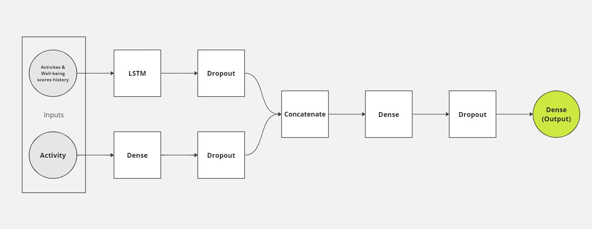

# Well-being Assistant

A mobile application that helps users to improve their well-being by recommending meals and exercises based on their mood and preferences.

## Running the project
1. Clone the repository
2. [Run the server](api/README.md)
3. [Run the mobile app](frontend/assistant/README.md)

## Recommendation model

### Architecture

There are actually two models: one for recommending meals, and the second for recommending exercises.

Each model outputs a well-being score for an activity. To make a recommendation for a user, the app will compare the well-being scores of all the activities and recommend the one with the highest score.

Both models follow the same architecture:
- Two input pathways: one for the activities history along with the well-being score after each activity, and the second for currently analyzed activity
- Activites history pathway:
    - The activities history is passed through an LSTM layer to capture the sequence of activities and their well-being scores
    - The output of the LSTM layer is passed through a dropout layer for regularization
- Currently analyzed activity pathway:
    - The currently analyzed activity is passed through a dense layer
    - The output of the dense layer is passed through a dropout layer for regularization
- The outputs of the two pathways are concatenated
 and passed through a dense layer
- The result is then regularized using a dropout layer, and passed through a dense layer to output the well-being score